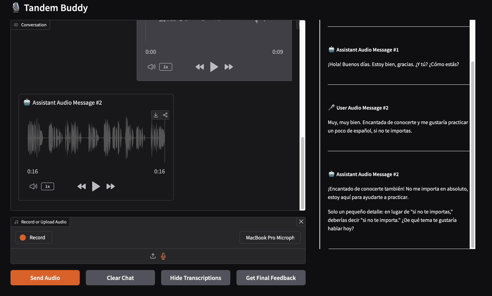
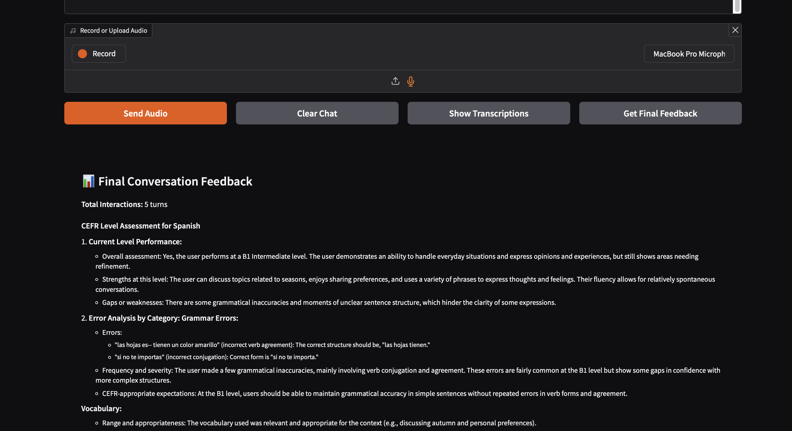

# Tandem Buddy 🗣️

A voice-based language learning companion that helps you practice speaking Spanish through natural conversations, just like chatting with a friend through audios on WhatsApp.

## Screenshot

Interface and transcriptions available. The image shows an example of light feedback.


Interface for the final/detailed feedback. The image shows an example of the detailed feedback.


## What is Tandem Buddy?

Tandem Buddy is an AI-powered language practice app that simulates real conversations in Spanish. Unlike traditional language apps, it focuses purely on speaking practice.

🙅‍♀️ No typing, no multiple choice questions, just 🗣️ natural conversation practice.

## Features

- **🎙️ Voice-Only Conversations**: Practice speaking naturally through audio messages, similar to WhatsApp voice notes
- **💬 Real-time Light Feedback**: Get gentle corrections during your conversation without breaking the flow
- **📊 Comprehensive End Report**: Receive detailed feedback on your performance after each session (currently in English)
- **🎯 B1-C1 Level Focus**: Designed for intermediate learners who can already hold basic conversations
- **🤖 Natural AI Responses**: Powered by OpenAI's language models for realistic conversation
- **🔊 High-Quality Audio**: Uses ElevenLabs for natural-sounding Spanish speech

## Current Status

This is an early version with the following capabilities:
- ✅ Spanish conversation practice
- ✅ Real-time feedback on : grammar, syntax, vocabulary, etc.
- ✅ Detailed post-conversation analysis
- ⚠️ Final feedback currently in English only
- ⚠️ Spanish is the only supported language right now

## How It Works

1. Start a conversation with your Tandem Buddy
2. Speak naturally in Spanish using voice messages
3. Receive light, non-intrusive corrections as you go
4. At the end of your session, get a comprehensive feedback report

## Tech Stack

- **Speech Generation**: ElevenLabs
- **Language Model**: OpenAI
- **Interface**: Gradio 
- **Target Language**: Spanish
- **Feedback Language**: English

## Roadmap

Future improvements planned:
- [ ] Add more language support beyond Spanish
- [ ] Localize final feedback (Spanish and other languages)
- [ ] Multi-level support (A2, B2, C1, etc.)
- [ ] Progress tracking over time
- [ ] Level evaluation
- [ ] Practice describing images
- [ ] Language proficiency exam's practice
  
## Prerequisites

- Intermediate Spanish level (around B1)
- Microphone access
- Stable internet connection

## Getting Started

Launch the app using:
- [docker compose](#docker-compose)
- [dockerfile](#using-docker-container)
- [local](#local-env)

### Docker compose
`docker-compose up`

### Using docker container

#### Building: 
`docker build -t tandem-buddy-app .`


#### Running the container: 

Running the docker container with the env parameter. Bare in mind that the
docker needs a very specific formatting. If possible opt to use the docker-compose
instead.

`docker run -it --rm -p 7860:7860 --env-file $(pwd)/.env tandem-buddy-app`

### local env

```bash
python -m venv .venv
source .venv/bin/activate
pip install .

python app.py
```

## Feedback

This app is under active development. Your feedback is valuable!

📧 Contact: coffeedrunkpanda.studio@gmail.com

## License

**Personal/Educational Use**: Free and open source

**Commercial Use**: Requires a paid license

CC BY-NC 4.0 - See [LICENSE](LICENSE) file for details.

---

Built with ❤️ for language learners who want to actually *speak* the language they're learning.


